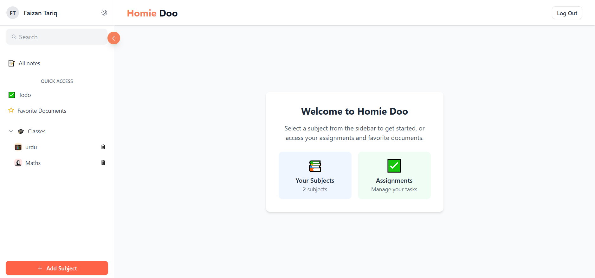
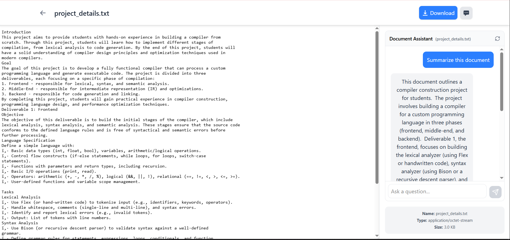

# Homie-Do Project Documentation

## Project Overview

Homie-Do is a full-stack web application developed using modern technologies, featuring a React-based frontend and a Node.js backend. The project follows a modular architecture and adheres to best practices for both frontend and backend development. It serves as a dedicated platform for students to manage their study materials, track pending assignments, and organize notes. The platform also includes an integrated chatbot that allows users to ask questions related to the specific topic or file they are currently viewing.

## Frontend (React Application)

### Technology Stack

- React 19
- Vite as build tool
- TailwindCSS for styling
- Radix UI for accessible components
- Zustand for state management
- React Router for navigation
- Various UI enhancement libraries (HeroIcons, Lucide React, etc.)

### Project Screenshots

#### Landing Page


The landing page serves as the entry point to the application, showcasing the main features and providing navigation options for users.

#### Login Page


The login page provides secure authentication options including email/password login and Google OAuth integration.

#### Dashboard


The dashboard displays an overview of user's study materials, pending assignments, and quick access to important features.

#### Document Viewer


The document viewer allows users to read and interact with their study materials, with an integrated chatbot for topic-specific assistance.

### Key Modules

#### 1. Components (`/src/components/`)

- Reusable UI components
- Built with Radix UI primitives
- Styled using TailwindCSS

#### 2. Pages (`/src/pages/`)

- Main application views
- Route-based components
- Page-specific layouts

#### 3. Store (`/src/store/`)

- State management using Zustand
- Global application state
- Data persistence

#### 4. Services (`/src/services/`)

- API integration
- External service connections
- Data fetching and manipulation

#### 5. Utils (`/src/utils/`)

- Helper functions
- Utility methods
- Common functionality

#### 6. Hooks (`/src/hooks/`)

- Custom React hooks
- Reusable logic
- State management helpers

#### 7. Context (`/src/context/`)

- React Context providers
- Global state management
- Theme and authentication contexts

#### 8. Assets (`/src/assets/`)

- Static resources
- Images and icons
- Media files

## Backend (Node.js Application)

### Technology Stack

- Node.js with Express
- MongoDB with Mongoose
- JWT for authentication
- Passport.js for OAuth
- Various security and utility packages

### Key Modules

#### 1. App Structure (`/src/app.js`)

- Main application entry point
- Server configuration
- Middleware setup

#### 2. Application Logic (`/src/app/`)

- Business logic implementation
- Route handlers
- Controller functions

#### 3. Database (`/src/database/`)

- Database models
- Schema definitions
- Database connections

#### 4. Utils (`/src/utils/`)

- Helper functions
- Utility methods
- Common backend functionality

### Key Features

1. Authentication & Authorization

   - JWT-based authentication
   - Google OAuth integration
   - Secure password handling

2. API Integration

   - RESTful API endpoints
   - Google AI integration
   - Email functionality

3. Security

   - Password encryption
   - JWT token management
   - CORS configuration

4. File Handling
   - Cloudinary integration
   - File upload capabilities
   - Media management

## Development Tools

- ESLint for code linting
- Nodemon for backend development
- Vite for frontend development
- TailwindCSS for styling
- TypeScript support

## Getting Started

1. Clone the repository
2. Install dependencies for both frontend and backend
3. Set up environment variables
4. Run development servers
   - Frontend: `npm run dev` in the react/homie-doo directory
   - Backend: `npm run dev` in the backend directory

## Project Structure

```
homie-do/
├── backend/               # Backend Node.js application
│   ├── src/
│   │   ├── app/          # Application logic
│   │   ├── database/     # Database models and connections
│   │   ├── utils/        # Utility functions
│   │   └── app.js        # Main application file
│   └── package.json
│
└── react/
    └── homie-doo/        # Frontend React application
        ├── src/
        │   ├── components/   # Reusable UI components
        │   ├── pages/        # Page components
        │   ├── store/        # State management
        │   ├── services/     # API services
        │   ├── utils/        # Utility functions
        │   ├── hooks/        # Custom React hooks
        │   ├── context/      # React context providers
        │   └── assets/       # Static assets
        └── package.json
```
